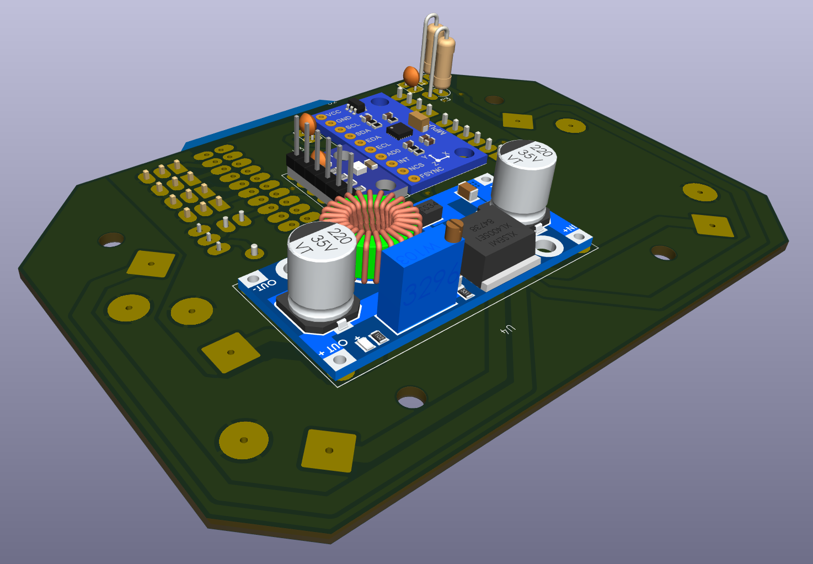

# ESP32FC - PCB for X Quadcopter Drones




This repository contains the PCB designs and hardware documentation for a flight controller extension board based on the [esp-fc](https://github.com/rtlopez/esp-fc) project. The board is designed to connect an ESP32  microcontroller to a set of peripherals commonly used in unmanned aerial vehicles (UAVs) and robotics.

## 📦 Project Structure

The project contains two PCB versions:

* **v1-single-sided**: A one-layer PCB version, considered functional and stable, but not actively maintained.
**Note: This version has not yet been built or tested, as its dimensions are too large to fit inside the intended drone frame.**

* **v2-double-sided**: A two-layer PCB version, under active development, with continuous improvements and upgrades.

## 🧩 Features

* **Microcontroller**: ESP-WROOM-32 - ESP32 D1 Mini DevKit
* **IMU & Barometer**: SPI connection to MPU9250 and BMP250 (separated modules)
* **Motor Outputs**: 4 motor outputs, supporting PWM, Oneshot and DShot protocols
* **Serial Interfaces**:

  * `Serial1`: USB-to-serial for configuration (through Betaflight Configurator)
  * `Serial2`: Connection to ELRS receiver (CRSF protocol)
  * `Serial3`: Optional GPS or other peripheral like vtx smart audio (still not implemented in version 0.2.1)
* **Battery Monitoring**: Voltage divider for battery voltage measurement
* **Status Indication**: Piezo buzzer
* **Power Inputs**: LiPo battery connector
* **Power Outputs**:

  * ESCs power lines
  * Companion computer (e.g., Jetson Nano)

The board is designed to be installed in a standard F450 X-frame drone, but may also be adapted to fit other drone models with minor modifications.
## 🗂 Folder Overview

```text
hardware/                  PCB designs
  └── v1-single-sided/     Single-layer version
  └── v2-double-sided/     Dual-layer version
        └── exports/       3d images, BOM, g 
        └── kicad_pcb/    
  └── library/             Custom symbols & footprints
firmware/                  Optional test or support code
  └── ...
docs/                      Diagrams and usage docs
tools/                     Scripts for BOM or Gerber generation
```

## 🔧 Development

All initial configuration for the ESP32 module should be done following the instructions provided by @rtlopez in his esp-fc repository. This includes flashing the firmware, setting up the environment, and configuring the board.

Pin remapping specific to this board design (e.g., motor outputs, SPI, UARTs, battery monitor, buzzer) should be defined according to the layout described in the firmware/ section of this repository. Additional notes and configuration tips will be included there as development progresses.

All PCB designs are created using KiCad 9. Exports include Gerbers, BOMs, and 3D renders. Contributions are welcome, especially to the v2-double-sided version.

## 📝 License

This project is licensed under the **GPLv3**, following the upstream [esp-fc](https://github.com/rtlopez/esp-fc) licensing terms.

## 👤 Author & Maintainer

Developed and maintained by fxrnando. Based on the work of [@rtlopez](https://github.com/rtlopez).

---

Feel free to fork, modify, or contribute improvements to the hardware. If you build one, let us know!
